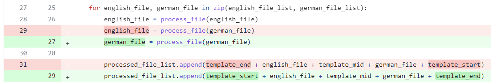

# Preprocessing for German to English Translation

This repository contains [a preprocessing code](main.py) for german to english translation and sub-samples of [english](english.txt) and [german](german.txt) sentences.\
Note: This repository is **forked from [SKKU SWE2021 week6 assignment](https://github.com/agwaBom/Assignment_6)** and modified for week11 lecture.

## Run
***
To preprocess sampled data, please run:
```bash
>> python3 main.py
```

## Modifications
***
Several modifications were made to make the existing incorrect code (intentionally incorrect) work correctly.

> ### Inside of [train_file_list_to_json' function](https://github.com/hmtyj2/Assignment_6-1/blob/9e86c3ef4647289ec497255a68d0dc110680f3d6/main.py#L8)
>> 

